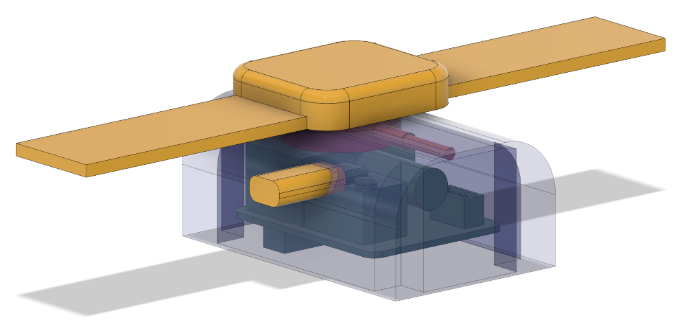
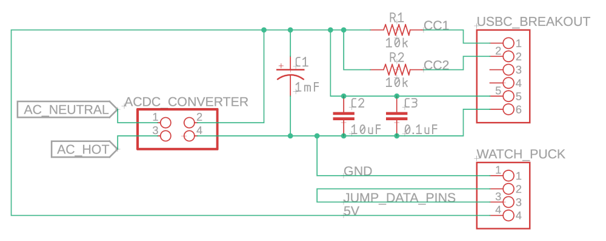

# Nightstand Dual Apple Device Charger

A simple, safe dual charger for Apple devices designed to look nice on a nightstand.

## Objectives

- Build something safe that charges two Apple devices (iPhone via USB-C and Apple Watch)
- Create a clean, compact design that looks nice on a nightstand
- Use readily available components

## Parts List

- AC extension cord
- AC/DC Converter (5V 3W output)
- Prototype board and solid 22AWG hookup wire
- 4-pin JST connector
- 100oμF polarized capacitor
- 0.1μF ceramic capacitor
- 10μF ceramic capacitor
- Two 10KΩ resistors
- USB-C breakout board with CC1, CC2, VCC, and GND pins
- 3D printed enclosure
- Four rubber feet

## Assembly

### Power Conversion

1. Soldered the AC/DC converter to the prototype board
2. Clipped the extension cord and soldered it to the converter AC pins on the bottom of the prototype board
3. Extended 5V and GND across from the converter DC pins using hookup wire so the remainder of the components could be connected

### Circuit Wiring

#### Signal Connections

- **CC1** connects to one of the 10KΩ resistors
- **CC2** connects to the other 10KΩ resistor
- The other side of both 10KΩ resistors connects to 5V — this provides a "signal" to the USB-C equipment indicating the charger can supply up to 3W

#### Capacitor Placement

- The three capacitors all bridge 5V and GND
- The 0.1μF and 10μF capacitors should be placed as close to the USB-C breakout as possible
- The 1000μF polarized capacitor can be placed closer to the converter

#### Watch Puck Connection

I had an old magnetic watch puck charger that was not in use, so I cut the wire and crimped it into the 4-pin JST connector.

**Note:** For the watch puck to receive the correct signal, you can use an older USB standard — simply short the data lines (green and white wires) together.

### Final Assembly

I packed the components as tightly as possible to keep the enclosure compact.

## Enclosure

The enclosure was designed in Autodesk Fusion 360. I have included both the 3MF and F3D files in this repository if you want to reuse or modify the design:

- `NightstandCharger.3mf` — Ready-to-print file
- `NightstandCharger.f3d` — Fusion 360 source file

## License

See [LICENSE](LICENSE) for details.
